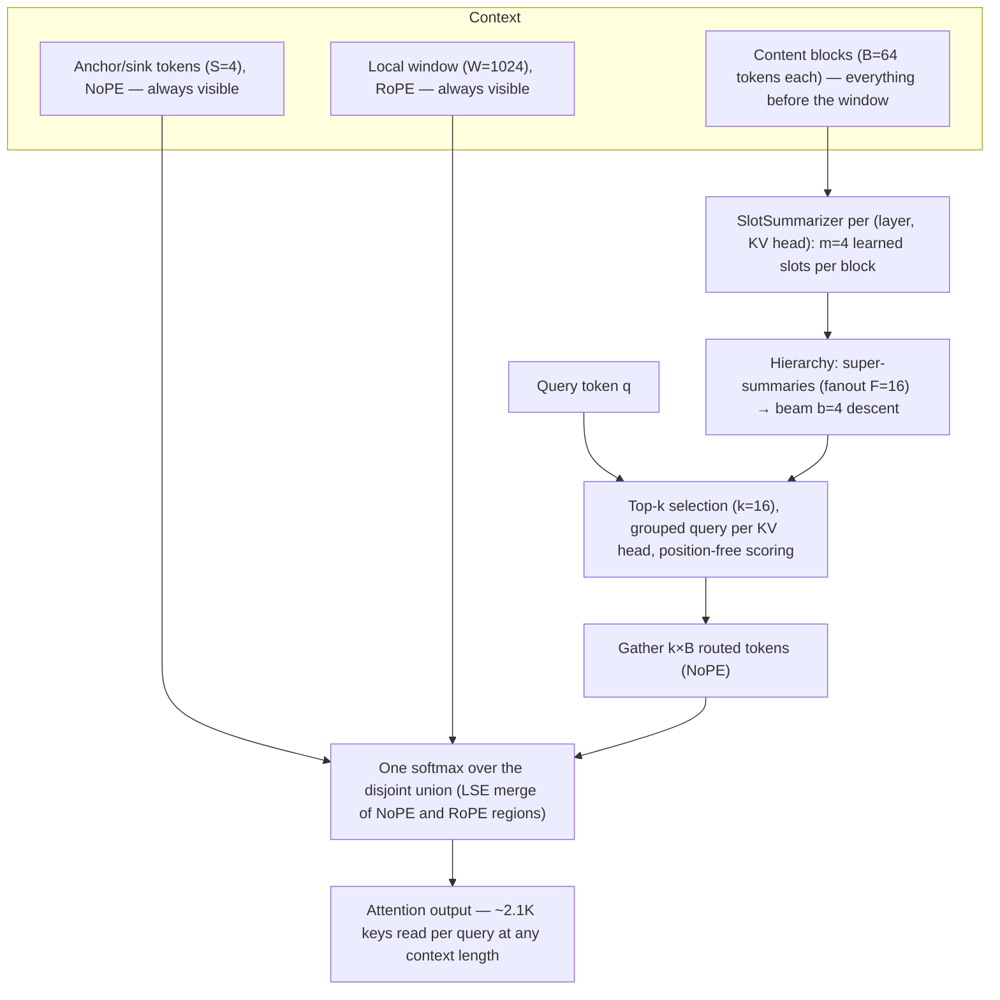

# HBA architecture

This document specifies Hierarchical Block Attention precisely enough to reimplement it. Parameter values given are the validated 0.5B reference configuration; the architecture is geometry-agnostic and larger models scale the knobs (noted where relevant).

## Notation

| Symbol | Meaning | Reference value |
|---|---|---|
| `n` | context length | 4K–128K |
| `S` | number of anchor/sink tokens (prefix) | 4 |
| `W` | local RoPE window size | 1024 |
| `B` | key/value block size | 64 |
| `k` | routed blocks per query group | 16 |
| `m` | summary slots per block per (layer, KV head) | 4 |
| `G` | query heads per KV head (GQA group size) | model-dependent (7 in the 0.5B validation donor) |
| `N` | candidate block count = `⌈(n − W − S)/B⌉` | grows with `n` |
| `F`, `b` | hierarchy fanout, beam width | 16, 4 |

## The three components

Every attention layer computes one softmax over the **disjoint union** of three key/value regions:

1. **Anchor/sink tokens** — the first `S` tokens, attended by every query, **position-free** (no RoPE, "NoPE"). Pretrained models park a large fraction of attention mass (~25% measured) on early tokens; serving them unconditionally preserves that mechanism at negligible cost.
2. **Local RoPE window** — the last `W` tokens before the query, with standard rotary embeddings. This is the only place position enters the computation. Because `W` is fixed, relative positions inside the window never exceed what training saw — **the model never extrapolates positionally**, at any context length.
3. **Routed content blocks** — all tokens strictly before the window are grouped into blocks of `B`. Each block is advertised by learned summary vectors; each query scores the summaries **without RoPE** and attends exactly to the tokens of its top-`k` blocks. Long-range attention is thus purely content-addressed.

The regions are disjoint by construction (window tokens are excluded from blocks), so the union softmax is exact:

```
attn(q) = softmax_over( {q·k_i : i ∈ sinks} ∪ {q·k_i^RoPE : i ∈ window} ∪ {q·k_i : i ∈ selected blocks} ) · V
```

In a fused implementation this is computed as a **log-sum-exp merge** of two attention calls — one NoPE region (sinks + routed blocks) and one RoPE sliding-window region — which avoids materializing any `n×n` tensor and yielded a 5.3× end-to-end training speedup over the naive path in our implementation (agreement with the naive reference ~1e-6).

### Design note: why the window keeps RoPE

HBA removes positional encoding from **long range** — where extrapolation beyond training
offsets is what breaks length generalization — not from the model. Inside the window it is
kept, deliberately:

- **Local order carries meaning.** Syntax, negation, and adjacency are genuinely
  position-dependent; measured attention in pretrained models is position-structured
  locally and content-addressed at distance. The decomposition mirrors that split.
- **Confined RoPE cannot extrapolate.** With relative offsets capped at `W`, the rotary
  computation is permanently in-distribution at any sequence length. The failure mode is
  amputated; the mechanism is not.
- **Conversion economics.** A pretrained donor's local attention behavior lives in its
  RoPE'd Q/K geometry. Keeping window RoPE means that behavior transfers intact, which is
  a large part of why the attention-only healing stage is cheap. Replacing it would mean
  relearning local attention — the expensive part — from scratch.

Concurrent from-scratch work (Thinking Machines' Inkling) makes the other choice: a
learnt, content-dependent additive distance bias over the same-sized local window, with no
rotary embeddings anywhere. That is a defensible design when pretraining from scratch and
plausibly more expressive, at a higher kernel cost (the bias must be materialized inside
the attention tile loop). For converting existing checkpoints, window-RoPE is the
pragmatic optimum. The accurate summary of both designs is the same: **no positional
encoding beyond the local window.**

## Slot summarizers

Mean-pooling blocks into single vectors is a demonstrably weak router (see README principle 3). Instead, each (layer, KV head) owns a **SlotSummarizer**: `m` learned probe vectors that cross-attend into the block's keys, producing `m` slot vectors per block. A block's routing score for query `q` is:

```
score(q, block) = max over m slots of ( q_nope · slot )
```

Max-over-slots lets a block advertise several distinct things it contains (a name, a number, a code identifier) rather than their average, which is what lifts routing recall 1.8–5.1× over mean-pooling. The summarizer's projection is **identity-initialized** — a small-random init shrinks the slot vectors toward zero, flattening block scores and killing the summarizer's training signal.

## GQA-grouped selection

Selection is per **KV head**, shared by its `G` query heads, using the **grouped query** (sum of the group's query heads) to score blocks. One block set per group means the KV cache's sharing structure survives conversion: routed keys/values are gathered once per KV head and broadcast to the group for exact attention. The summarizer's training target is likewise the group-averaged content mass (see [training-recipe.md](training-recipe.md)).

## Hierarchy

Flat selection compares each query group against all `N` block summaries — `O(N)` per query, fine at 32K, wasteful beyond. HBA adds a second level: block summaries are pooled into **super-summaries** of `F` blocks each. Selection descends with a beam: score all super-summaries, keep the top `b`, score only their `F·b` children, take the final top-`k`.

- **Fidelity:** two-level beam descent recovers the flat top-`k` selection nearly exactly at these depths (measured agreement on selected sets is near-perfect; all reported quality numbers are unchanged between flat and hierarchical selection at the lengths where both run).
- **Measured speedup** (summary comparisons per query, vs flat): **5.2× at 32K, 7.9× at 64K, 10.6× at 128K.**
- Depth generalizes: additional levels give `O(log N)` selection; two levels suffice through 128K.

## Softmax calibration across candidate counts (read this before scaling context)

The union softmax has one subtlety that does not exist in dense attention: **the routed region's aggregate mass depends on how many candidate blocks compete**. Train at context `n₀` and the model calibrates its NoPE logit scale against `N₀` candidates. Serve at `2n₀` and roughly `2N₀` candidates contribute — even if each irrelevant block is only *slightly* warm, their summed exponentials dilute the softmax and can bury a still-sharp correct-answer logit.

This is measurable and severe. Our discriminator at 2× the trained context, same weights throughout (32-trial probe; read accuracies coarsely):

| Configuration | Retrieval acc | Median rank of answer token |
|---|---|---|
| Dense mode (full attention, same weights) | **0.531** | **1** |
| HBA path, routing off (window + sinks only) | 0.156 | ~2,300 |
| HBA path, routing on | 0.031 | ~56,000 |

The weights are perfect (dense-mode rank 1); block *selection* is also fine (oracle selection matches learned selection). The failure is purely the diluted union softmax. Two mitigations:

1. **Length curriculum (primary).** Train at the mixture of lengths you intend to serve. Calibration is learned; the model must see the candidate-count regime. This is a repair-scale job (a fraction of the healing budget), not a retraining job. Spec in [training-recipe.md](training-recipe.md).
2. **Log-N temperature (assist, not fix).** Scale the NoPE region's logits by `τ = 1 + c·log(N/N_cal)` (identity at the calibration length). At `c ≈ 0.05–0.1` this doubled accuracy and moved answer mass ~30×, but plateaued ~8× below dense-mode accuracy; larger `c` over-sharpens. Consistent with the general rule that analytic knobs for learned miscalibrations are partial. A related trained-length-clamped temperature appears in concurrent independent work on position-free long-range attention (Thinking Machines' Inkling), which we take as convergent evidence for both the phenomenon and the boundary choice — their position-aware window is also 1,024 tokens.

Structural options under evaluation for the large-scale run: QK-norm with fixed scaling on the NoPE branch, which bounds content logits and makes cross-length calibration architectural rather than learned.

## Complexity

Per-query attended tokens are constant by construction: `S + W + k·B` (= 4 + 1024 + 1024 = 2,052, ~**2.1K keys** in the reference config), independent of `n`. Selection cost is `O(N)` flat or `O(b·F + N/F)` hierarchical. Memory is dominated by the KV cache (linear in `n`, same as dense — HBA saves *bandwidth and compute* per query, and the block structure is amenable to offloading cold blocks, since only summaries must stay resident for selection).

Measured end-to-end evaluation footprint (0.5B model, bf16, single GPU):

| Context | Per-query keys read | Peak memory | Hierarchical selection speedup |
|---|---|---|---|
| 32K | ~2.1K | 4.3 GiB | 5.2× |
| 64K | ~2.1K | 6.8 GiB | 7.9× |
| 128K | ~2.1K | 11.8 GiB (KV-cache dominated) | 10.6× |

## Attention decomposition (diagram)


